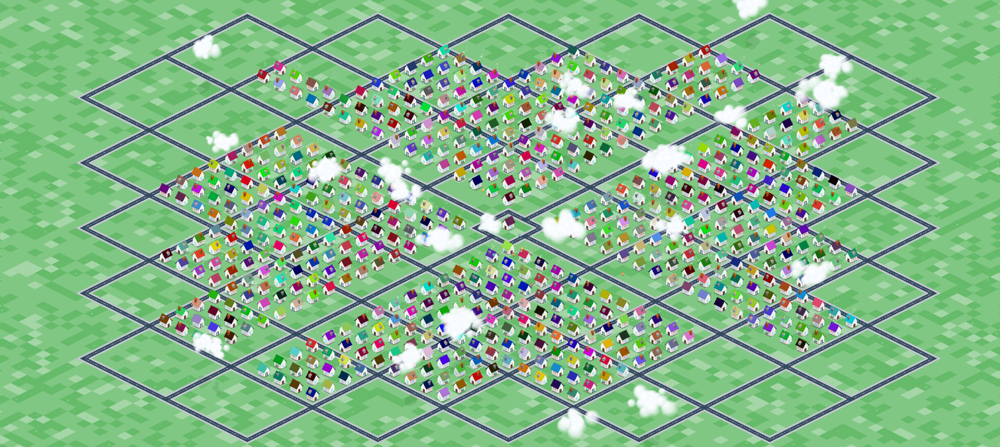

# 🏘️ GitVille - GitHub Stargazer City

[](https://addressmehari.github.io/GitVille/)

> **⭐️ Star this repository to get your own house in the city!**
>
> GitVille is a creative visualization of this repo's stargazers. Every star automatically builds a unique house in an infinite, interactive isometric world.
>
> **[👉 Visit the Live City](https://addressmehari.github.io/GitVille/)**

[](https://opensource.org/licenses/MIT)
[](https://www.python.org/)
[]()
[](https://addressmehari.github.io/GitVille/)

---

## 📖 Table of Contents
- [✨ Features](#-features)
- [📸 Gallery](#-gallery)
- [How It Works](#-how-it-works)
- [🚀 Quick Start](#-quick-start)
- [🎮 Controls](#-controls)
- [⚙️ Configuration](#-configuration)
- [🤖 Automations](#--automations)

---

## ✨ Features

- **Isometric Rendering**: A custom-built 2:1 isometric engine using HTML5 Canvas.
- **Dynamic World**: The city grows as the repository gets more stars.
- **Living Environment**:
  - 🌤️ **Day/Night Cycles**: Automatic transitions affecting lighting and shadows.
  - 🌧️ **Weather System**: Particle-based rain and environmental effects.
  - 💨 **Procedural Vegetation**: Grass, flowers, and trees that sway in the wind.
  - ☁️ **Cloud System**: Moving clouds casting shadows on the ground.
  - 🚶 **NPCs**: Tiny inhabitants wandering the streets.
- **Interactive**: Zoom, pan, and inspect houses.

---

## 📸 Gallery

<p align="center">
  
  
  
  
  
  
</p>

---

## 🔍 How It Works

GitVille bridges the gap between GitHub data and visual art. Here is the flow of data:

```
⭐ GitHub API
     |
     v
🐍 fetch_stargazers.py
     |
     v
📁 Data Files
 ├── houses.json
 ├── roads.json
     |
     v
🌍 world.py
     |
     v
🌐 Frontend App
     |
     v
🎨 Canvas (City Render)
```

1.  **Data Fetching**: The `fetch_stargazers.py` script pulls the latest stargazers.
2.  **Layout Generation**: It calculates grid positions, organizing houses into a city layout with roads.
3.  **State Management**: `world.py` manages environmental state (weather, time of day).
4.  **Rendering**: The browser loads the JSON data and `script.js` renders the isometric world.

---


---

## 🎮 Controls

| Action | Mouse | Touch |
| :--- | :--- | :--- |
| **Pan** | Click & Drag | Swipe |
| **Zoom** | Scroll Wheel | Pinch |
| **Interact** | Left Click on House | Tap on House |

---

## ⚙️ Configuration

You can manually tweak the world state by editing `world.json` or using the helper script.

<details>
<summary><strong>🌍 World State Commands</strong></summary>

Use `world.py` to toggle environmental effects:

```bash
# Randomize Weather (Rain/Clear)
python world.py weather

# Toggle Day/Night
python world.py daynightcycle
```

The frontend will automatically reflect these changes on the next reload (or if configured to poll).

</details>

---

## 🤖 Automations

This repository includes GitHub Actions to keep the city alive:

- **Update Stargazers**: Runs regularly to fetch new stars and expand the city.
- **Weather Cycle**: Changes the weather periodically to keep the view dynamic.
- **Day/Night Cycle**: Synchronizes the visual theme with scheduled times.

---


<p align="center">
  Made with ❤️ for the Open Source Community
</p>
